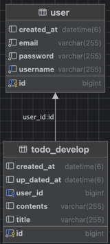
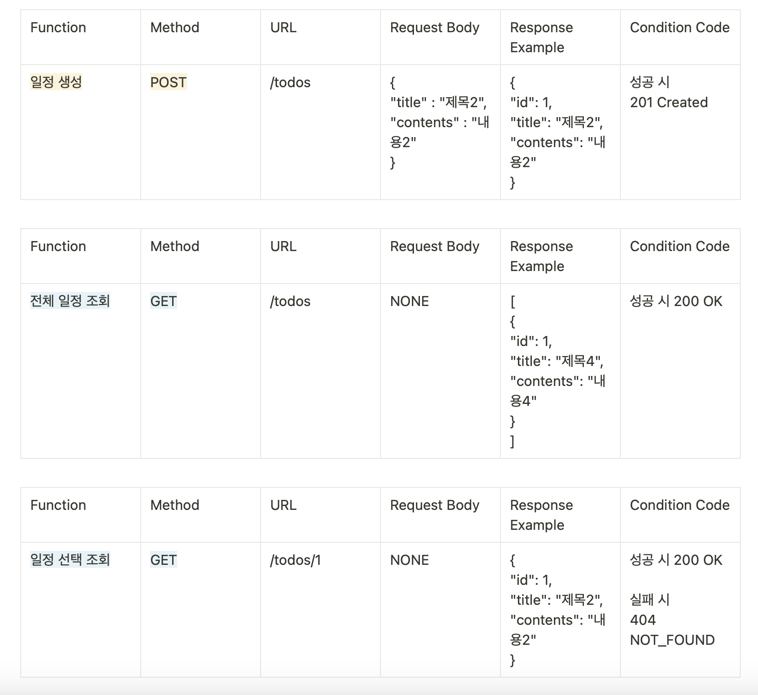
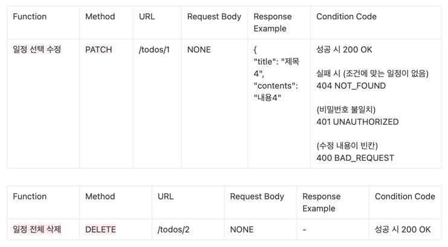
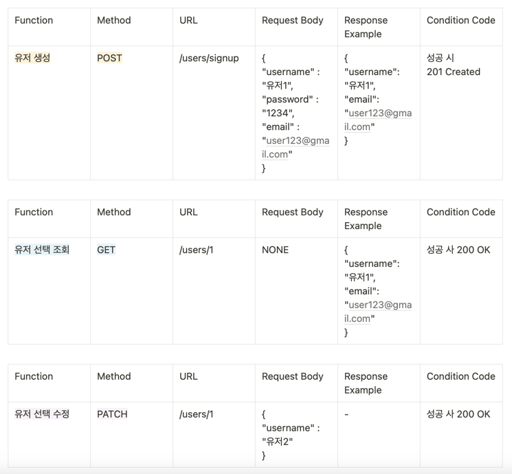
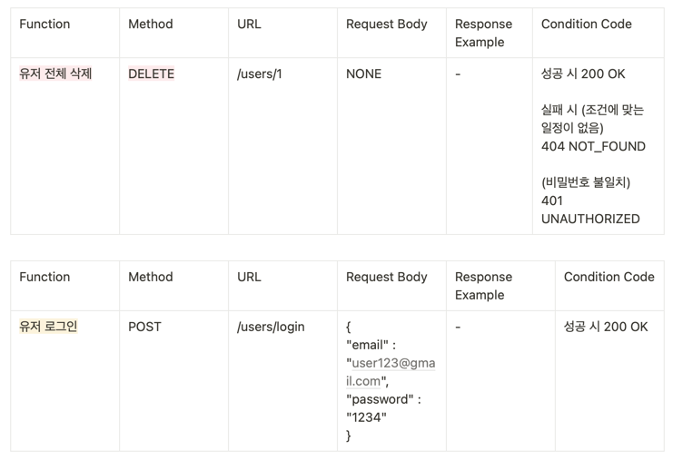

# [목차]

1. 프로젝트의 목적과 기능
2. 기능 맛보기
2. ERD 다이어그램
3. API 명세서

---
# [목적]

1. JPA를 활용한 데이터베이스 관리와 cookie/session을 활용한 인증/인가를 할 수 있다.

2. 기본 CRUD에 대한 구조 이해할 수 있다.

3. 기본적인 보안 개념과 인증 메커니즘을 명확히 이해할 수 있다.

4. 3 Layer Architecture에 따라 각 Layer의 목적에 맞게 개발할 수 있다.

# [기능]

### <유저 관련>

일정 생성 (C)

전체 일정 목록 조회 (R)

선택 일정 목록 조회 (R)

일정 일부 수정 (U)

일정 전채 삭제 (D)

--

### <유저 관련>

유저 생성 (C)

유저 전체 조회 (R)

유저 선택 조회 (R)

유저 수정 (U)

유저 삭제 (D)

---

## [기능 맛보기]

- 일정 생성

  

- 유저 생성

  

---

## [ERD 다이어그램]

---

# [Lv.4 API 명세서]

## <일정 관련 CRUD>

## <유저 관련 CRUD>

